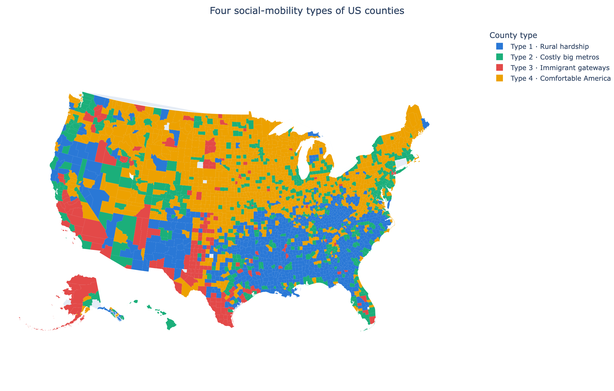
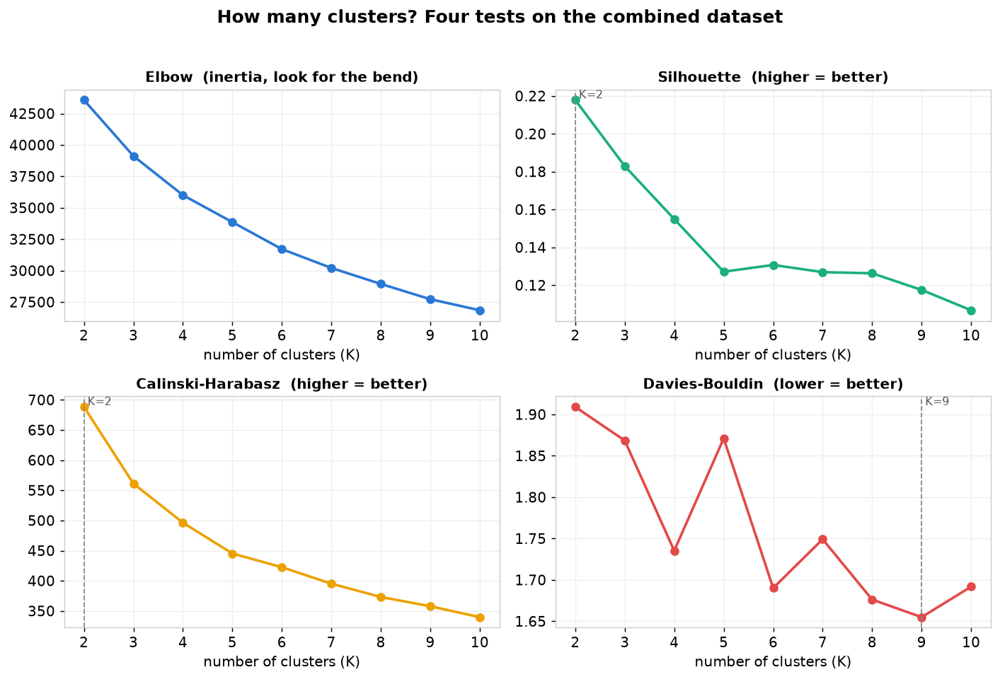
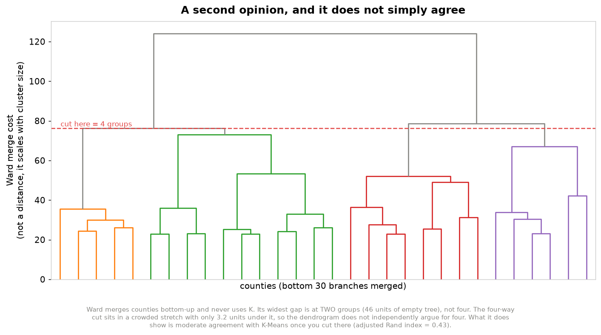
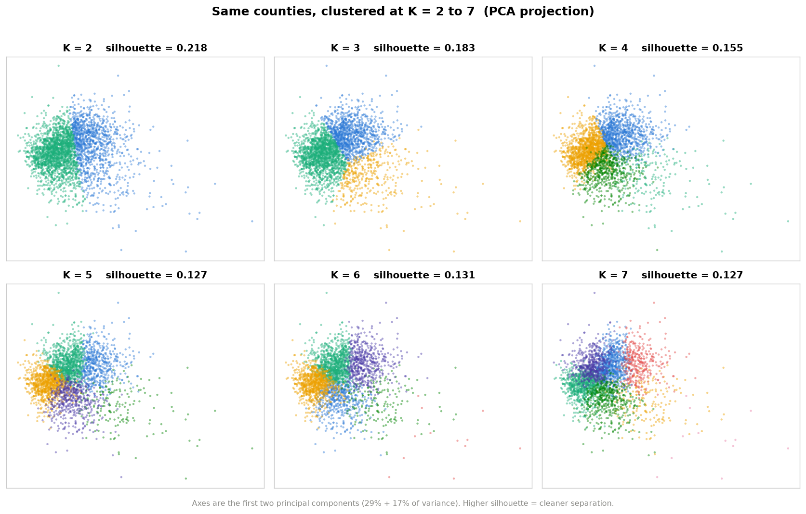
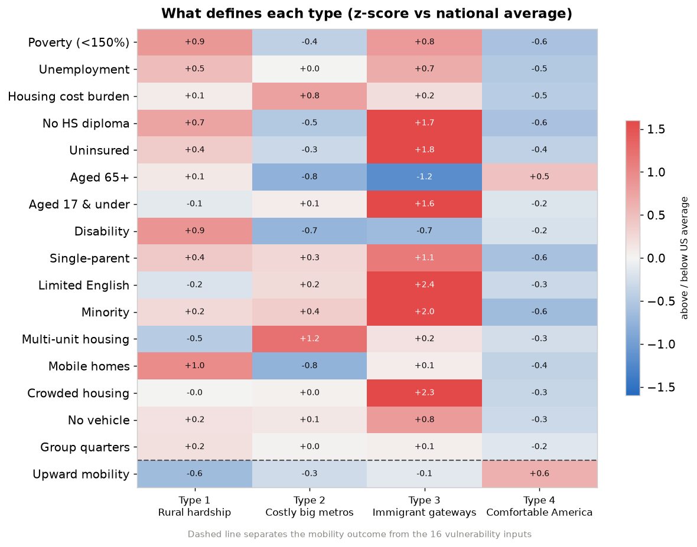
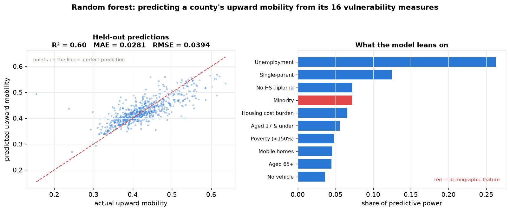
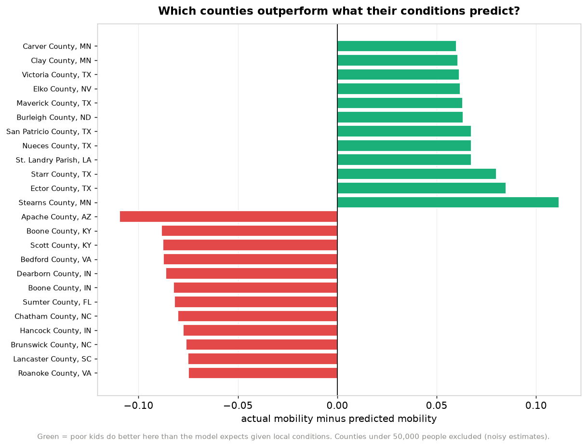
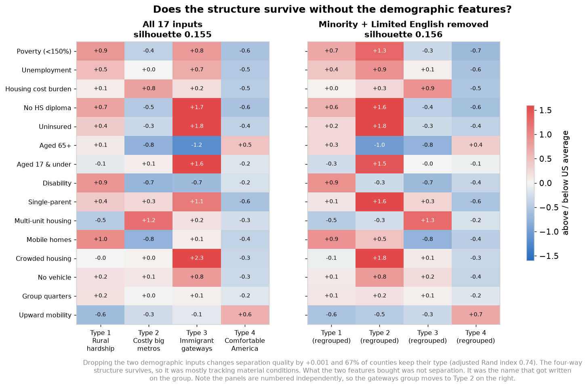

# What Kind of Place Is Your County?

This project sorts 3,128 US counties into a handful of types, using 16 social vulnerability measures and one number that matters a lot, which is how much money kids raised poor in a place go on to earn as adults. Then it spends most of its energy on a harder question. Are those groups real, or are they just an artifact of what somebody decided to measure? Built with K-Means clustering, hierarchical validation, and a supervised random forest, in Python with scikit-learn and Streamlit.

Maharsh studies at UIUC, where the gap between Downtown Champaign and Campus Town is impossible to miss. So it was a genuinely fun surprise when the model decided that **Champaign County Illinois** is most like **Ingham County Michigan, Alachua County Florida, Tippecanoe County Indiana, Johnson County Iowa, and Charlottesville City Virginia**. Every single one is a college town. They sit an average of 376 miles apart. Nobody told this thing that universities exist. It worked that out from poverty rates, housing, and age structure alone.



**[Go try it](https://county-clustering.streamlit.app)**. Uncheck any measure in the sidebar and the model refits right in front of you. Turn off Minority and Limited English and watch how little actually moves.

---

## Problem Statement

Public health and anti poverty programs usually rank counties worst to best and send help down the list. A ranking tells you *who* is struggling. It has nothing to say about *what kind* of trouble they are in.

That difference decides whether an intervention lands. A rural county where a third of homes are mobile homes and a quarter of adults have a disability needs something completely different from a coastal metro where families are priced out of housing they could otherwise reach. Call both of them "high need" and you have thrown away the one piece of information that would tell you what to send.

The stakes here are pretty concrete. Where a child grows up measurably changes what they earn later, and county level funding decisions get made every budget cycle with a ranking as the input. If grouping counties by *kind* turns out to be more useful than ordering them by severity, that is a change an agency could adopt tomorrow.

There is a second problem sitting underneath the first one, and honestly it is the one this project spends most of its time on. Any grouping is a function of what you decided to measure in the first place. The Social Vulnerability Index counts minority status as a component of vulnerability. Hand that to a clustering algorithm and it will hand back a group defined by race, which a human then gives a name to. The question worth answering was whether these groups track material conditions or ethnicity, so the project includes an experiment that could easily have been embarrassing.

## Key Results

1. **Four types of American county fell out of the data**, numbered by mean upward mobility so that Type 1 is always the lowest.

   | Type | Counties | Mean mobility | What stands out (z-scores) |
   |---|---|---|---|
   | **1. Rural hardship** | 987 | 0.390 | Mobile homes +1.0, disability +0.9, poverty +0.9 |
   | **2. Costly big metros** | 630 | 0.412 | Multi-unit housing +1.2, housing cost burden +0.8 |
   | **3. Immigrant gateways** | 196 | 0.422 | Limited English +2.4, crowded housing +2.3, minority +2.0 |
   | **4. Comfortable America** | 1,315 | 0.470 | Mobility +0.6, minority -0.6 |

2. **The two demographic features improved cluster separation by 0.001.** Refitting without minority share and limited English moved silhouette from 0.155 to 0.156, and 67% of counties kept the type they already had (adjusted Rand index 0.735). Statistically those two columns did nothing at all. What they bought was the *name* that got written on the group.

3. **Sixteen vulnerability measures predict 60% of the variance in upward mobility.** A random forest on a held out 20% test set reached R² 0.600, MAE 0.0281, and RMSE 0.0394. That beats linear regression by ten points of R², which says the relationships are not straight lines. Unemployment on its own carries 26% of the predictive weight.

4. **The 40% the model misses is where the interesting stuff lives.** RMSE runs 1.40 times MAE, meaning a small number of counties get missed badly. Ranking counties by how far they beat their own prediction surfaces Stearns County MN, Ector County TX, and Starr County TX as places doing noticeably better for their poor kids than their conditions would suggest. A severity ranking buries every one of them somewhere in the middle.

5. **Four statistical tests for the number of clusters gave four different answers** (silhouette 2, Calinski-Harabasz 2, Davies-Bouldin 9, elbow 3). The project runs 4 anyway and explains why below. Ward hierarchical clustering, which never sees K at all, finds a real gap at the four way cut.

6. **[A live interactive version](https://county-clustering.streamlit.app)** lets anybody refit the model themselves. Every checkbox drops a measure and redraws the map, so the claim that these groups depend on what got measured is something you can go test rather than something you have to take on faith.

## Methodologies

**Type of learning.** Unsupervised clustering, with a supervised regression bolted on afterwards as a sanity check.

| Method | Inputs | Output | Why it is here |
|---|---|---|---|
| **K-Means** | 16 SVI measures plus mobility, standardized | one type label per county | Centroids read directly as a profile |
| **PCA** | the same 17 standardized features | 2 components | Only used to draw clusters in 2-D |
| **Ward hierarchical** | the same 17 features | dendrogram | Tests whether 4 is a real seam, without using K |
| **Random forest** | the 16 SVI measures only | predicted mobility plus importances | Do the inputs predict the outcome at all? |

Every feature gets standardized to mean 0 and standard deviation 1 before clustering. K-Means measures straight line distance, so raw percentages would let whichever column happened to have the widest range quietly run the whole show. Clusters then get renumbered by mean mobility after fitting, which keeps Type 1 as the lowest mobility group on every single run no matter what order K-Means felt like assigning its labels in.

**Why K-Means, and what it costs.** The centroids *are* the answer. Each one reads as a profile of a kind of place, and a method that produced better separated but uninterpretable groups would have been useless here. On the other side of the ledger, K-Means assumes clusters are round and roughly the same size, which county data is definitely not. It forces every county into some group, so there is no "this place is unlike anything else" option. K gets picked by a person rather than learned. And the whole thing sits at the mercy of feature selection and scaling, which is exactly the weakness the bias probe goes after.

**Choosing K.** Silhouette and Calinski-Harabasz both want K=2, and that is a real finding rather than a bug. At the coarsest level American counties split into doing fine and not doing fine. That split is the cleanest one statistically and completely useless analytically, because it is the same ranking this project was trying to get away from. Davies-Bouldin wants K=9, which produces groups too small to act on. K=4 got chosen for interpretability, and saying that out loud beats quietly reporting whichever K flattered the metrics.



That choice did not just get taken on faith either. Ward linkage, built from the bottom up and never told about K, shows a long vertical gap right where the four way cut lands. It only partly reproduces the K-Means grouping (adjusted Rand index 0.43), which says the seam at four is real but that exactly where the lines fall depends on which method you asked. That is a limitation, not a footnote.



**Evaluating the clusters.** Silhouette, Calinski-Harabasz, and Davies-Bouldin all run across K=2 through 10, alongside a visual sweep of the same counties clustered at every K from 2 to 7. The sweep is the honest version of the argument. You can watch the groups hold together as K climbs and then start splitting hairs.



Each type then becomes a profile of z-scores, which is more or less the entire model in one picture.



**Evaluating the supervised model.** An 80/20 train test split, scored only on data the model never got to see.

| Model | R² | MAE | RMSE |
|---|---|---|---|
| Linear regression | 0.503 | 0.0323 | 0.0439 |
| **Random forest** | **0.600** | **0.0281** | **0.0394** |



RMSE comes out 1.40 times MAE. Because RMSE squares errors before averaging, that gap says the model is not uniformly a little bit wrong. It is close on most counties and badly off on a few. Those few are exactly what the next figure is built out of.

**Finding the counties that beat their odds.** Predictions here come from cross validation, so no county ever gets scored by a model that trained on it, and then everything gets ranked by residual. Counties under 50,000 people are left out because their mobility estimates rest on too few children to trust.



**Testing the project's own bias.** The entire pipeline gets refit without minority share and limited English, and then the difference gets measured.



| | All 17 measures | Two demographic measures removed |
|---|---|---|
| Silhouette | 0.155 | **0.156** |
| Counties keeping their type | | **66.8%** |
| Adjusted Rand index vs original | | **0.735** |

Type 3 comes back as a group defined by crowded housing (+1.8), being uninsured (+1.8), and single parenthood (+1.6). The same places, described by what they are up against instead of by who lives there.

### How AI/ML Can Amplify or Mitigate Bias Here

There are three places bias gets into this pipeline, and the algorithm is not any of them.

**What got measured.** SVI counts minority status as a component of vulnerability. CDC has defensible reasons for that, since these communities really do face compounded barriers during a disaster. But K-Means has no idea *why* a column is sitting in front of it. Standardizing handed all 17 features equal variance, which quietly announced that a county's minority share matters exactly as much as its unemployment rate. Nobody decided that. It was the default.

**What the result got called.** The model outputs the integer 2. "Immigrant gateways" came from a person. The probe shows that group is actually held together by crowded housing and lack of insurance, so a more accurate name would be something closer to "high deprivation young metros." The first name that came to mind described who lives somewhere rather than what they are up against, and a policymaker reading it would walk away with a different idea about cause.

**What somebody might do with it.** Allocating resources by type means every county in a group gets treated identically. The original proposal listed aggregation bias as a caveat. Acting on these clusters turns that caveat into a mechanism.

**Mitigation is the whole reason the probe exists.** Writing a disclaimer would have been easy and worthless, so instead there is a test whose result could have gone badly. It partly did. A third of counties change type once the demographic features come out, so those features are not inert. But separation quality does not improve at all, which means there is no performance argument for keeping them. In the live app, the checkboxes that reproduce this experiment are the first thing anyone sees.

**The case for doing this.** Typing instead of ranking lets you notice that Type 3 counties carry high vulnerability *and* better than expected mobility, which means copying an intervention from Type 4 into Type 1 might be exactly the wrong move. The residual ranking points at specific counties doing something right, and a severity ranking cannot even ask that question.

**The case against.** Four labels stretched over 3,128 counties is a lot of forgetting. "Comfortable America" holds 1,315 counties and plenty of them are not comfortable. A cluster label is a stereotype with a confidence interval that nobody ever prints.

### Limitations

- **Mobility is historical.** These estimates follow children born around 1978 to 1983. They describe the county those kids grew up in, which is not necessarily the county standing there today.
- **Small counties are noisy.** Estimates for low population counties rest on very few children. The resilience ranking drops anything under 50,000 people, and the raw figures do not.
- **Correlation only.** An R² of 0.60 says the features track the outcome. Nothing here shows that changing a county's unemployment rate would change what its children earn.
- **County averages hide neighborhoods.** Cook County contains some of the highest and lowest mobility tracts in the country and shows up here as a single dot.
- **Coverage.** The analysis covers 3,128 of roughly 3,143 US counties. Eleven are missing from the merged file to begin with and four more got dropped for missing values. Nobody has audited which ones yet, and a systematic absence would bias the whole thing.
- **The four names are editorial.** See the bias probe.

### How the Project Changed

The original proposal was to cluster **CDC PLACES 2024**, which is 40 measures of disease and access to care. The dataset changed partway through, and the reason was already sitting in that same proposal. It flagged that PLACES values are *modeled estimates* built from a survey plus demographics rather than actual counts. That turns out to be fatal for clustering. If two counties look demographically similar, the model that generated PLACES gives them similar health numbers by construction, so clustering PLACES risks rediscovering the imputation model instead of learning anything about health.

Switching to the **CDC/ATSDR Social Vulnerability Index**, which is built from American Community Survey counts, and joining it to county upward mobility estimates bought something PLACES could never have offered. An actual outcome variable. Every PLACES column is one more description of a county. Mobility is a result. Having one made the supervised model, the residual analysis, and the resilience ranking possible at all.

The hardest problem along the way was those four K selection tests disagreeing completely. The fix was to stop treating it as a question with one right answer, report all four disagreements openly, choose on interpretability grounds, and then validate with a second method built on entirely different principles.

## Data Sources

- **CDC/ATSDR Social Vulnerability Index**, county level. 16 `EP_*` estimate fields plus the `RPL_THEMES` overall percentile. [atsdr.cdc.gov/place-health/php/svi](https://www.atsdr.cdc.gov/place-health/php/svi/index.html)
- **NCHS Urban-Rural Classification Scheme** (`CODE2023`), running from 1 for large central metro through 6 for non core rural. Used as context rather than as a clustering input.
- **County upward mobility** (`MOBILITY`), the mean adult household income rank for children raised at the 25th percentile. Values land in the 0.39 to 0.47 range that characterizes the Opportunity Atlas `kfr_pooled_pooled_p25` measure. *This attribution stays provisional until the exact file and vintage get confirmed.*
- **County boundaries** for mapping, from the Plotly sample GeoJSON dataset.

### References

1. Chetty, R., Friedman, J. N., Hendren, N., Jones, M. R., & Porter, S. R. (2026). The Opportunity Atlas: Mapping the childhood roots of social mobility. *American Economic Review, 116*(1), 1-51. [NBER w25147](https://www.nber.org/papers/w25147)
2. Flanagan, B. E., Gregory, E. W., Hallisey, E. J., Heitgerd, J. L., & Lewis, B. (2011). A social vulnerability index for disaster management. *Journal of Homeland Security and Emergency Management, 8*(1). [10.2202/1547-7355.1792](https://doi.org/10.2202/1547-7355.1792)
3. Flanagan, B. E., Hallisey, E. J., Adams, E., & Lavery, A. (2018). Measuring community vulnerability to natural and anthropogenic hazards: The CDC's Social Vulnerability Index. *Journal of Environmental Health, 80*(10), 34-36.
4. Chetty, R., Jackson, M. O., Kuchler, T., Stroebel, J., et al. (2022). Social capital I: Measurement and associations with economic mobility. *Nature, 608*, 108-121. [10.1038/s41586-022-04996-4](https://doi.org/10.1038/s41586-022-04996-4)
5. Chetty, R., Jackson, M. O., Kuchler, T., Stroebel, J., et al. (2022). Social capital II: Determinants of economic connectedness. *Nature, 608*, 122-134. [10.1038/s41586-022-04997-3](https://doi.org/10.1038/s41586-022-04997-3)
6. Bowser, D. M., Mauricio, K., Ruscitti, B. A., & Crown, W. H. (2024). American clusters: Using machine learning to understand health and health care disparities in the United States. *Health Affairs Scholar, 2*(3), qxae017. [10.1093/haschl/qxae017](https://doi.org/10.1093/haschl/qxae017)
7. Khan, S. S., Krefman, A. E., McCabe, M. E., Petito, L. C., Yang, X., Kershaw, K. N., Pool, L. R., & Allen, N. B. (2022). Association between county-level risk groups and COVID-19 outcomes in the United States: A socioecological study. *BMC Public Health, 22*, Article 81. [10.1186/s12889-021-12469-y](https://doi.org/10.1186/s12889-021-12469-y)

## Technologies Used

- **Python 3.14**
- **scikit-learn** for K-Means, PCA, the random forest, the train test split, cross validated prediction, and every clustering and regression metric
- **SciPy** for Ward hierarchical linkage and the dendrogram
- **pandas** and **NumPy** for data preparation and the z-score profiles
- **Matplotlib** for the eight static figures
- **Plotly** for the choropleth maps and the interactive charts
- **Streamlit** for the live explorer

### Running It Yourself

```bash
python -m venv .venv
./.venv/bin/python -m pip install -r requirements.txt

./.venv/bin/python analysis.py       # writes all 8 figures plus combined_clusters.csv
./.venv/bin/python test_app.py       # smoke test for clustering, type ordering, neighbours
./.venv/bin/python -m streamlit run app.py
```

`analysis.py` takes about a minute, and most of that is the cross validated random forest. Run it before the app, because the app reads the predictions it writes out.

| File | What it is |
|---|---|
| `analysis.py` | The whole pipeline, top to bottom, 8 figures |
| `app.py` | The interactive explorer |
| `test_app.py` | Checks type ordering, ablation wiring, and the neighbour search |
| `figures/combined_clusters.csv` | Every county with its type, prediction, and residual |

Inside the app, every sidebar checkbox removes a measure and refits everything downstream. Unchecking Minority and Limited English reproduces the bias probe live, and the silhouette readout shows the delta as it happens.

The hosted copy lives at **[county-clustering.streamlit.app](https://county-clustering.streamlit.app)**, running on Streamlit Community Cloud against this repo's `main`, so it redeploys on every push. GitHub Pages serves the write up you are reading right now, but Pages only serves static files and cannot run the app itself.

## Authors

**Maharsh Jani** ([majani2@illinois.edu](mailto:majani2@illinois.edu))

Harshitha Sheshala, Anelda Agyei, Cyril Joseph

### License

Copyright © 2026 Maharsh Jani. Released under the [GNU Affero General Public License v3.0](LICENSE).

AGPL is the strongest copyleft license the OSI approves. Anything built on this code has to stay open under the same terms, and section 13 stretches that to cover network use. Host a modified version as a web service and you owe your users the source. That clause is the reason AGPL got picked over plain GPL, since the main artifact here is a hosted app and a license without it would leave the obvious loophole wide open.

The underlying data is public and carries its own terms. See the Data Sources section.

### Next Steps

| What | By when |
|---|---|
| Audit which 15 counties are missing and whether their absence is systematic | |
| Weight counties by population in the resilience ranking so it stops favoring small places | |
| Record the demo video | |

Longer term, the residual analysis is the piece worth carrying forward. Working out which counties beat their predicted mobility is a real research question, and pairing it with the Chetty social capital measures would make it possible to test whether cross class friendship explains the gap this model leaves open.
